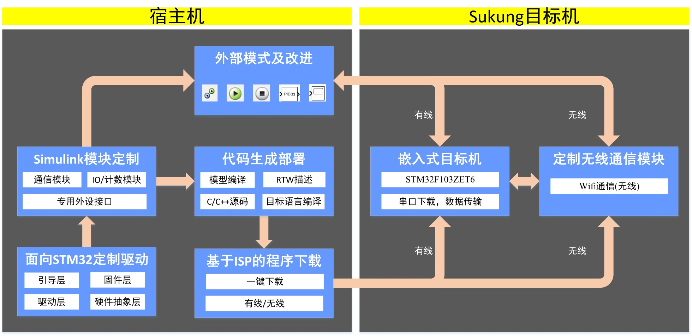

1.2 技术架构
------------

   Sukung系统的技术架构如下图所示。

1.2.1 面向STM32的定制驱动
~~~~~~~~~~~~~~~~~~~~~~~~~

   定制驱动层是资源实时调度方案中为提高环境模型执行实时性而提出的解决方案。定制驱动层不仅在寄存器层面优化了片内外设的调用逻辑，提高了片内外设的调用协同性和效率，同时还对HAL和LL开源驱动库保持了高度的兼容性，以便能够快速部署现有代码。定制驱动层作为目标机控制被控对象的媒介，共分为四层：引导层、固件层、驱动层和硬件抽象层。

1.2.2 Simulink模块定制
~~~~~~~~~~~~~~~~~~~~~~

   半实物仿真平台的功能扩展依赖于模块定制技术，各种传感器模块、驱动模块及成型算法可使用模块定制技术集成至半实物仿真平台中。面向实际应用，开发三类常用模块，如图4所示，包括：常用通信接口、常规IO/计数模块、专用外设接口。

      · 常用通信接口：USART, I2C, SPI, CAN;

      · 常规IO/计数模块：AD, DA, IO Blocks, Counter, Timer;

      · 专用外设接口：Display, Motor(两轮小车，独轮车，单个电机), PWM(L298N，TB6612FNG), Sensor(MPU6050，GY271，超声波);

   .. image:: media/image4.png
      :align: center
      :scale: 80 %

1.2.3 代码生成部署
~~~~~~~~~~~~~~~~~~

   代码生成部署技术是将宿主机中Simulink可视化系统模型转换为目标机可运行控制器的关键技术，该技术涉及代码生成、优化、编译、连接、下载等多个过程。

1.2.4 外部模式及改进
~~~~~~~~~~~~~~~~~~~~

   目标机与宿主机之间的相互通讯依赖于外部模式。外部模式作为宿主机和目标机之间的通信信道，通过调用双方的传输层接口实现物理对接。外部模式作为通讯部分的载体主要用于完成目标机状态控制、信号触发判断、信号数据记录及信号数据回传等任务。这些任务在嵌入式目标机的运行过程中占据了很大的比重，耗时较长且内存占用大，极易造成通讯的非实时，导致控制与通讯任务相互耦合。在Sukung研发中着重对外部模式的实时性进行了改进。

1.2.5 基于ISP的程序下载
~~~~~~~~~~~~~~~~~~~~~~~

   提供一种基于ISP的一键式程序下载，简便易用。分为串口下载与无线下载两种模式。在 :ref:`LED灯` 中介绍使用方式。

1.2.6 嵌入式目标机
~~~~~~~~~~~~~~~~~~

   目标机是运行嵌入式软件的硬件平台，Sukung系统选用的目标机为STM32F103ZET6(基础型，144引脚，512K闪存，QFP封装)，性能稳定，功能丰富。定制驱动主要面向该类目标机进行研发。

1.2.7 定制实时通信模块
~~~~~~~~~~~~~~~~~~~~~~

   宿主机通过目标机及时获取被控对象传感器或者目标机系统模型中信号采样点的数据，同时宿主机也可以及时向目标机下发控制命令。目前主要分为有线和无线两种通信方式。有线传输采用串口通信，通过宿主机的外部模式实现与目标机的实时通信；无线传输则采用WiFi通信，通过TCP/IP协议，实现宿主机和目标机之间的通信。
