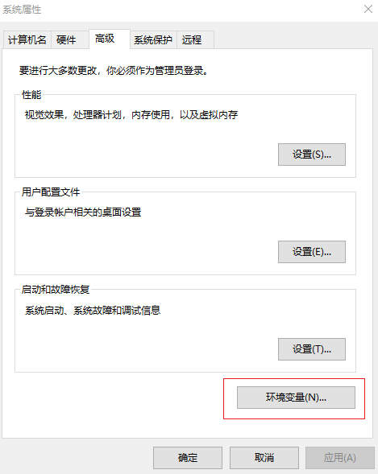

步骤2：环境变量及路径配置（\ `环境变量 <https://jingyan.baidu.com/article/a17d5285c9b0c48099c8f26a.html?qq-pf-to=pcqq.c2c>`__\ ）
~~~~~~~~~~~~~~~~~~~~~~~~~~~~~~~~~~~~~~~~~~~~~~~~~~~~~~~~~~~~~~~~~~~~~~~~~~~~~~~~~~~~~~~~~~~~~~~~~~~~~~~~~~~~~~~~~~~~~~~~~~~~~~~~~~~~~~~~~~~~~~~~

   上述软件安装完成之后，进行MATLAB和Sukung根目录的环境变量配置，以及对应库文件、可执行文件、编译器和下载程序的路径配置。

   |image1|\ |image2|

   -  1. **新建** 系统变量 ``MATLAB_ROOT``：根据先前MATLAB的安装路径，设定该变量值为 ``C:\SoftwareProgram\MATLAB``；
   -  2. **新建** 系统变量 ``SUKUNG_ROOT``：根据先前Sukung的安装路径，设定该变量值为 ``C:\SoftwareProgram\Sukung``；
   -  3. **编辑** ``Path`` 环境变量，**新建** 以下四个变量值，即定位到MATLAB、Keil和Sukung软件安装路径的下述文件夹，完成对可执行文件、编译器、库文件和下载程序的路径配置：
 
      -  (a) ``C:\SoftwareProgram\MATLAB\bin\win64``
      -  (b) ``C:\SoftwareProgram\Keil\ARM\ARMCLANG\bin``
      -  (c) ``C:\SoftwareProgram\Sukung\lib``
      -  (d) ``C:\SoftwareProgram\Sukung\script\download``

   完成上述过程后，环境变量界面应当如下所示：

   .. figure:: Setup_Media/image3.png
      :align: center
      :scale: 85 %

   .. figure:: Setup_Media/image4.png
      :align: center
      :scale: 100 %

   -  4. 除了对环境变量配置，还需设置MATLAB对Sukung的文件路径包含。在MATLAB主界面，打开 ``设置路径`` 子界面，点击 ``添加并包含子文件夹`` ,包含Sukung软件的安装路径，即此次示例中的 ``C:\\SoftwareProgram\Sukung`` ，具体见下图。

   .. figure:: Setup_Media/image5.png
      :align: center
      :scale: 40 %

.. |image2| image:: Setup_Media/image2.png
   :scale: 60 %