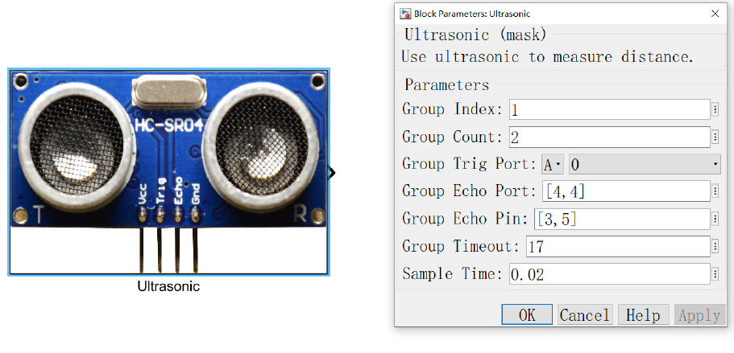

(3) 超声波传感器
--------------------

   通过此模块可实现一个或多个HC-SR04 芯片的超声波同时分组测距功能。
   
   对 HC-SR04芯片的测距原理的基本介绍；
      
      HC-SR04 模块为超声波测距模块。具有Vcc、Gnd、Trig 和Echo 四个引脚。Trig 是输出，Echo 是输入，Vcc 为5V 电压输入端，Gnd 为接地端。
      
      该模块的工作原理为，先向TRIG脚输入至少10us的触发信号,该模块内部将发出 8 个 40kHz 周期电平并检测回波。一旦检测到有回波信号则ECHO输出高电平回响信号。回响信号的脉冲宽度与所测的距离成正比。由此通过发射信号到收到的回响信号时间间隔可以计算得到距离。即：
      
         .. code-block:: C++

            distancesPtr[i]=(endTimes[i]-startTime)*34/2

   相关参数的配置说明：
   
      • ``Group Count``：对应组使用的超声波芯片数；
      • ``Group Trig Port``：对应组Trig 脚使用的引脚名称；
      • ``Group Echo Port`` 和 ``Group Echo Pin``：对应组Echo脚使用的引脚名称，( ``[4,4],[3,5]`` ) 对应PD3、PD5；
      • ``Group Timeout``：可测得的最长距离对应的所需仿真时间 (单位毫秒) ；
      • ``ample Time``：采样时间，注意应略大于 ``Group Timeout`` 以免导致数据遗失(单位秒) 。

.. note:: Group Echo Port 和Group Echo Pin 的列数应与Group Count 的数值保持一致。

.. note:: 我们在SWR案例中使用了 ``MPU6050`` 模块，用户可做参考。